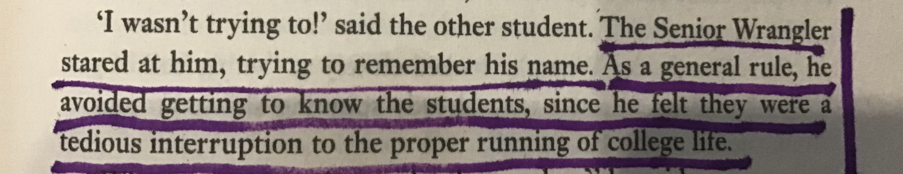

# Bond

Not James.

## University

Terry Pratchett is a little harsh here, but I can relate—during my 2 years as a research fellow at a Vienna university I experienced the painful phenomena of bonding w/ students only to have to unbond when they leave a year later and may be never see them again; so, w/ my tendency to bond, I concluded a university career was not for me.
