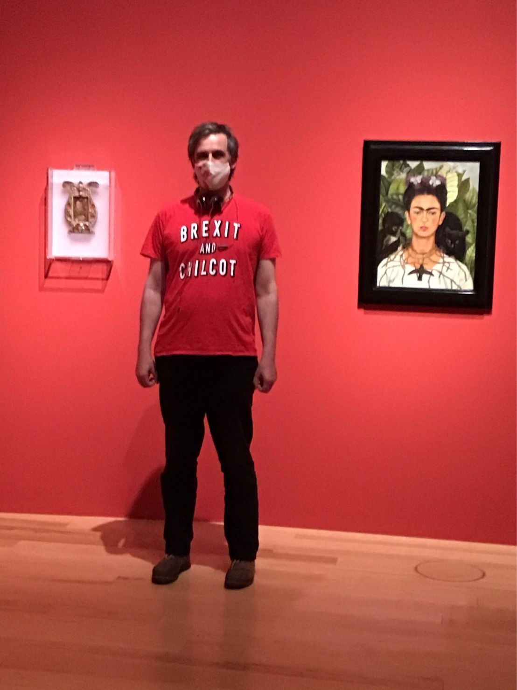
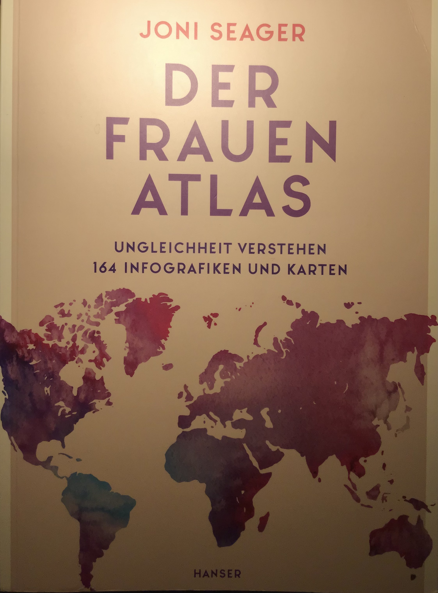

# Column

## 7 July 2021

"Mad Men is Sex and the City for the corporate world, besides—in Mad Men there is more sex, than in Sex and the City and Two and a Half Men—combined. Plus, and unrelated—in case you want to be up to date w/ the dictionary of the juvenile generation of today: one does not say "make love", "have sex" or "fuck" anymore ("fuck", especially, has transitioned so far from anything to do w/ sex, that a further transition is hardly possible)—one says "having a seggsy time". I assume that change of dictionary has been partially influenced by the Orwellian surveillance, which, at IQ of 40, still can't comprehend Pig Latin."

_published on LinkedIn_

## 8 July 2021

A basic course on organisational development I once took taught, that if one changes the corporate structure, but not the corporate culture, the legacy culture will twist the changed structure. With the Taliban filling the space freed by the departed US forces w/ the speed of water filling the void left by a removed previously submerged object, one asks—what did 1 000 000 people die for during the 20 years long war on terrorism? And what would have happened if the $5t spent on war was spent on peace? My t-shirt will be fashionable for many years to come: "Usually referred to as the Chilcot report by the news media, the document stated that ... a war was unnecessary." https://en.wikipedia.org/wiki/Iraq_Inquiry

_published on LinkedIn_

## 12 July 2021

"How are the mighty fallen..." writes the author of 2 Samuel 1:27 in year 550 BC, and the otherwise sympathetic Google boss fulfills the prophecy in 2021 by calling AI "more profound" than fire, electricity and internet—making the juvenile mistake of perception, where kids think, that the world began approximately when they were born, and see everything preceding them as unnecessary, boring and altogether a bother.

https://www.bbc.com/news/technology-57763382

[_published on LinkedIn_](https://www.linkedin.com/posts/dahoum_google-boss-sundar-pichai-warns-of-threats-activity-6820312792873099264-XESg)

## 16 July 2021

Semiotics is the science about signs and symbols. It helps us understand that in the Netherlands, for example, where Homo Bicycle has the same meaning as the Lion being the King of the Jungle; or the Queen of Sheba visiting King Salomon, who granted her every wish; or Moses parting the Red Sea—a "biking forbidden" sign has a completely different meaning, than the same sign, let's say in Germany—a country obsessed w/ cars to the point of suicide through climate change.

## 19 July 2021

The Women's Atlas. Understanding Inequality. 164 Infographics and Maps /// once I began reading Aleksandr Solzhenitsyn's The Gulag Archipelago and I could read only up to a point. Mark Twain is quoted saying: “Truth is stranger than Fiction, but it is because Fiction is obliged to stick to possibilities; Truth isn't.” Stephen King's books are pale in comparison w/ the reality facing women around the world. There are many forms of inequality. There are rich and poor, there are white and people of colour. There are women. John Lennon and Yoko Ono wrote in 1972 Woman Is the Nigger of the World. If someone thinks women are not, because they do not want to—one's world view is very, very narrow.

[_published on LinkedIn_](https://www.linkedin.com/posts/dahoum_the-womens-atlas-understanding-inequality-activity-6822979022239096832-oW-w)
