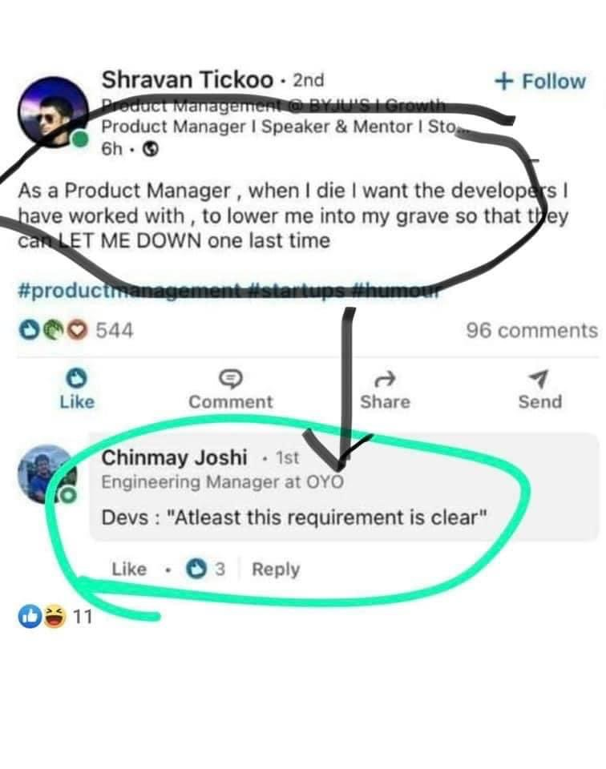

# Column

## 7 July 2021

"Mad Men is Sex and the City for the corporate world, besides—in Mad Men there is more sex, than in Sex and the City and Two and a Half Men—combined. Plus, and unrelated—in case you want to be up to date w/ the dictionary of the juvenile generation of today: one does not say "make love", "have sex" or "fuck" anymore ("fuck", especially, has transitioned so far from anything to do w/ sex, that a further transition is hardly possible)—one says "having a seggsy time". I assume that change of dictionary has been partially influenced by the Orwellian surveillance, which, at IQ of 40, still can't comprehend Pig Latin."

_published on LinkedIn_

## 8 July 2021

A basic course on organisational development I once took taught, that if one changes the corporate structure, but not the corporate culture, the legacy culture will twist the changed structure. With the Taliban filling the space freed by the departed US forces w/ the speed of water filling the void left by a removed previously submerged object, one asks—what did 1 000 000 people die for during the 20 years long war on terrorism? And what would have happened if the $5t spent on war was spent on peace? My t-shirt will be fashionable for many years to come: "Usually referred to as the Chilcot report by the news media, the document stated that ... a war was unnecessary." https://en.wikipedia.org/wiki/Iraq_Inquiry

_published on LinkedIn_

## 12 July 2021

"How are the mighty fallen..." writes the author of 2 Samuel 1:27 in year 550 BC, and the otherwise sympathetic Google boss fulfills the prophecy in 2021 by calling AI "more profound" than fire, electricity and internet—making the juvenile mistake of perception, where kids think, that the world began approximately when they were born, and see everything preceding them as unnecessary, boring and altogether a bother.

https://www.bbc.com/news/technology-57763382

[_published on LinkedIn_](https://www.linkedin.com/posts/dahoum_google-boss-sundar-pichai-warns-of-threats-activity-6820312792873099264-XESg)

## 16 July 2021

Semiotics is the science about signs and symbols. It helps us understand that in the Netherlands, for example, where Homo Bicycle has the same meaning as the Lion being the King of the Jungle; or the Queen of Sheba visiting King Salomon, who granted her every wish; or Moses parting the Red Sea—a "biking forbidden" sign has a completely different meaning, than the same sign, let's say in Germany—a country obsessed w/ cars to the point of suicide through climate change.

## 19 July 2021

The Women's Atlas. Understanding Inequality. 164 Infographics and Maps /// once I began reading Aleksandr Solzhenitsyn's The Gulag Archipelago and I could read only up to a point. Mark Twain is quoted saying: “Truth is stranger than Fiction, but it is because Fiction is obliged to stick to possibilities; Truth isn't.” Stephen King's books are pale in comparison w/ the reality facing women around the world. There are many forms of inequality. There are rich and poor, there are white and people of colour. There are women. John Lennon and Yoko Ono wrote in 1972 Woman Is the Nigger of the World. If someone thinks women are not, because they do not want to—one's world view is very, very narrow.

[_published on LinkedIn_](https://www.linkedin.com/posts/dahoum_the-womens-atlas-understanding-inequality-activity-6822979022239096832-oW-w)

## 21 July 2021

"You build bridges using waterfall and software using agile," I like to say. Which is only partially true—lies-to-children (https://en.wikipedia.org/wiki/Lie-to-children), as Jack Cohen, Ian Stewart and Terry Pratchett call it, based on work by Wittgenstein and Kierkegaard. The truth is—agile applies to buildings, too: "slow agile", we may call it. A good example for "slow agile" is the British Museum, which has a Victorian facade and a Queen Elizabeth II Great Court redeveloped in the 90s based on the 70s design by Sir Colin St John Wilson. It's a matter of time perspective.

[_published on LinkedIn_](https://www.linkedin.com/posts/dahoum_you-build-bridges-using-waterfall-and-software-activity-6823901332810817536-QByd)

## 22 July 2021

"Come over here Mr. Abrahams. Now do you know why you've lost the other day? Because you are over striding. Just a couple of inches. These coins represent the strides in your 100 meters. Have you got another two coins Mr. Abrahams? Or may be we can find them?" Sam Mussabini coaching Harold Abrahams in Chariots of Fire. You need a good coach not to reach your 98%. You need a good coach to reach the last 2%.

[_published on LinkedIn_](https://www.linkedin.com/posts/dahoum_come-over-here-mr-abrahams-now-do-you-activity-6824084522867421184-xBaR)

## 24 July 2021

My first WD-40. My fascination w/ lubricating oil began when I read Zen and the Art of Motorcycle Maintenance during my early—early early teenage years. For many years I believed WD-40 was mentioned there. Today I looked. It's not WD-40, but SAE-30. Both Zen and WD-40 are case studies in Semiotics, and while Robert M. Pirsig passed in 2017, [Garry Ridge](https://www.linkedin.com/in/garryridge/) is still around to inspire, while still alive.

[_published on LinkedIn_](https://www.linkedin.com/posts/dahoum_my-first-wd-40-my-fascination-w-lubricating-activity-6824798557309034496-Eov9)

## 25 July

Might sound a bit harsh, but even the Bible includes a warning: "Not many \[of you] should become teachers \[serving in an official teaching capacity], my brothers and sisters, for you know that we \[who are teachers] will be judged by a higher standard \[because we have assumed greater accountability and more condemnation if we teach incorrectly]." (James 1:3, Amplified Bible)

Psychology of Misunderstandings is a profound discipline. A successful Product Manager needs a galaxy of skills to be successful—and a universe, to be loved.

[_published on LinkedIn_](https://www.linkedin.com/posts/dahoum_might-sound-a-bit-harsh-but-even-the-bible-activity-6825178126444716032--0Ae)

## 27 July

### 22:00

That's me. I don't wanna crew members, who apply for a job, and then, when I did not reply w/in 2-3 days or 2-3 weeks or 2-3 months, have found another. The best people I have, we have flirted for ages.

[_published on LinkedIn_](https://www.linkedin.com/posts/dahoum_bill-murray-in-tootsie-activity-6825882109303914496-sX0N)

### 23:00

There is a kind of unhinged and restless geniuses, who re-purposes things in a way, which leaves one speechless. An example—building a computer, using the tracks, signals and the moving trains of a train simulator, which drives a 7-segment LED counter: https://youtu.be/GTjQa70wwCc

The intellectual complexity of this line work and the required perseverance are similar to these required in the field of Theoretical Physics, par example. The uselessness—too. The major difference is that it is that building a computer out of trains is a much cheaper hobby than, say—Astrophysics.

I have a few of those geniuses, and we are founding a Club of the Unhinged and Restless Geniuses—to satisfy the abyss of our intellectual drive. Think of it as an opium den: The Opium Den of the Unhinged and Restless Geniuses. You are welcome.

[_published on LinkedIn_](https://www.linkedin.com/posts/dahoum_there-is-a-kind-of-restless-and-unchanneled-activity-6825890825495441408-KZBX)

## 28 July

Employer or employee, if you want a good film about work-life-balance, Kramer v Kramer. Besides—if you havn't seen Dustin Hoffman as a young actor, you havn't seen Dustin Hoffman.

[_published on LinkedIn_](https://www.linkedin.com/posts/dahoum_employer-or-employee-if-you-want-a-good-activity-6825929087618453504-0axc)

### 23:00

"Where do you see yourself in 5 years?" is one of the poorest HR questions. Ever. Wait! One of the poorest things in business is the word "HR". People stopped being "resources" at the end of the Industrial Revolution. Just some people are still stuck in the past, the same way the school system is partially stuck in the Dark Ages. Good questions are: "Do you have a map?", "Where does the needle of your compass point to?", and "What does your map say in places, where it ends?" (Two options. The so so one: "Here be dragons.", and the good one: "Time for a new map!") The best question belongs to Lucifer Morningstar: "What is it that you truly desire?"

[_published on LinkedIn_](https://www.linkedin.com/posts/dahoum_where-do-you-see-yourself-in-5-years-is-activity-6826258139550109696-TObv)

## 29 July

Does the European Commission know they lost the cookie war? Most banners now have an easy "accept all" button, which turns on all cookies and a subtle and even painful process not to accept all cookies. So w/ the cookies we are exactly there, where we ended up w/ the war on terror: we undress at the airports.

[_published on LinkedIn_](https://www.linkedin.com/posts/dahoum_does-the-european-commission-know-they-lost-activity-6826610675050139648-Y2jY)
