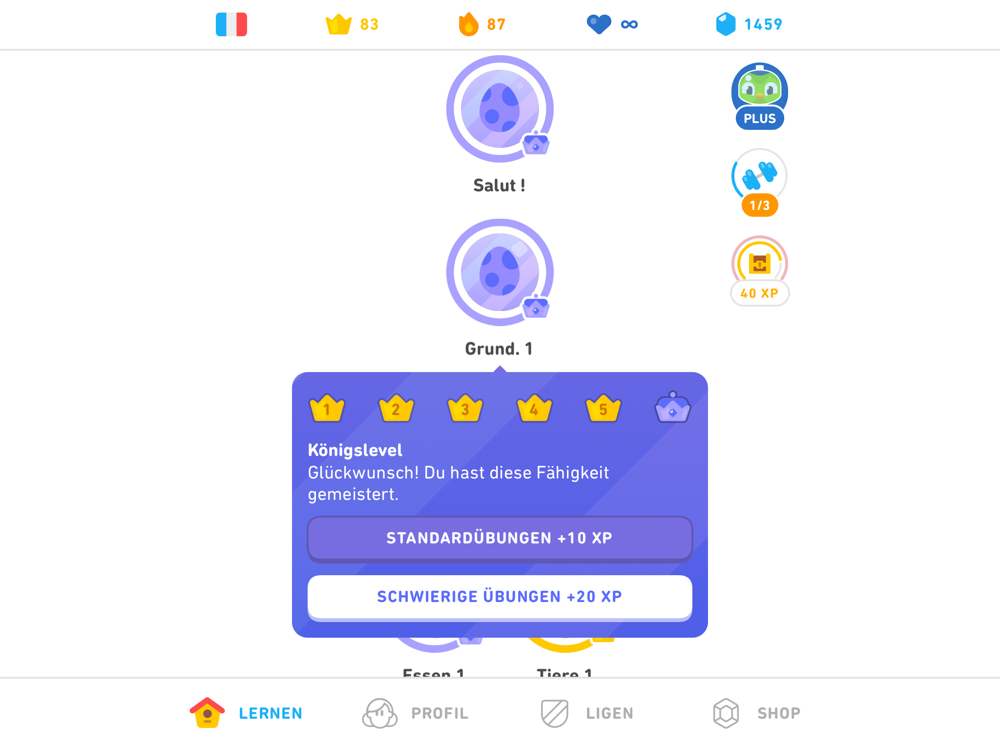

# Duolingo

_Or how to have fun while learning a language._

I've read so many articles explaining how Duolingo is not _enough_ to master a language, that I felt I should contravene.

Indeed, Duolingo is, _of course_, not enough to master a language!

But it is the funnest way to crack the nut!

What else to do during and after, at the end.

## Duolingo _is_

### Paragon of _intuitive_

Duolingo does not have even the remotest resemblance of Introduction, Help or Tutorial.

You open it, and you know how it works, all the way through.

### Addictive

Duolingo is dangerously _addictive_.

You can get hooked on points, leagues, competition w/ friends; on the pure intellectual pleasure of learning and having learned.

### Fun

## Else

Many articles explain the obvious: Duolingo is _not_ enough to master a language.

But as in any profession, Duolingo is one of the tools, and to me: a great first tool!

What can you do in parallel?

### Listen to the language (radio, TV, films, etc.)

Listening teaches your ear to recognise words.

In the background your brain recognises some, remembers the proximity of others, and altogether builds an invisible skeleton, which will, one day, suddenly come alive and scare the shit out of you.

Par example for French:

...

## Advanced

### How to earn a lot of points

#### Use the app

The website gives less points and does not have all the features.

#### Rehearse

Rehearsing gives you, once a day per lesson, 20 XP.

