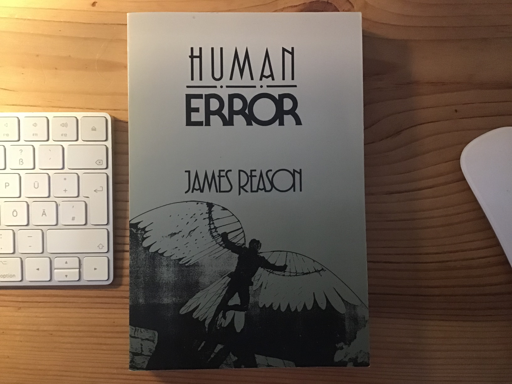

# Error

## Human Error

by James Reason

### James Reason Articles

James Reason: Patient Safety, Human Error, and Swiss Cheese

[PDF](Images/James_Reason_Patient_Safety_Human%20Error_and_Swiss_Cheese.pdf)

James Reason’s 12 Principles of Error Management

[URL](http://aerossurance.com/helicopters/james-reasons-12-principles-error-management/)

James Reason' Swiss Cheese Model of of Accident Causation

[URL](https://skybrary.aero/articles/james-reason-hf-model)

### Related

The Problem with Perfection

by Mel Schwartz

https://www.psychologytoday.com/us/blog/shift-mind/200811/the-problem-perfection
