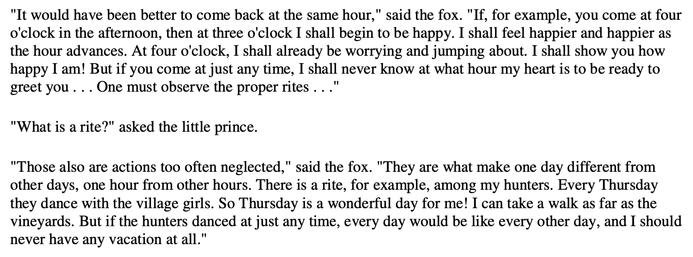

# Meeting

## Important

The most important part of a meeting is the preparation.

## Jour Fixe

Why jours fixes are better than ad hoc meetings, explained by Antoine de Saint-Exupéry in The Little Prince.

