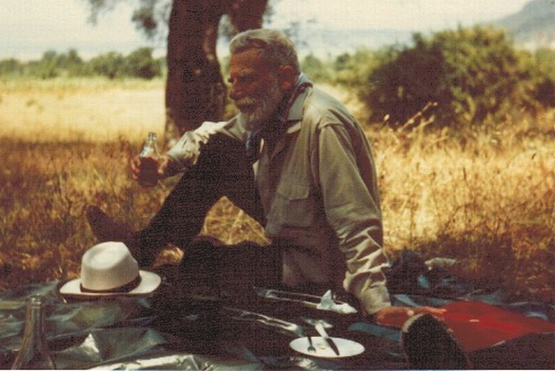

# People

## Prof. Bill Buchanan

http://linkedin.com/in/billatnapier

Professor of Cruptography at Edinburgh Napier University.

### Hear, hear

https://www.linkedin.com/posts/billatnapier_for-every-ipad-that-we-buy-kids-at-school-activity-6812998920826880001-5juq

## Leon Theremin

https://en.wikipedia.org/wiki/Leon_Theremin

https://en.wikipedia.org/wiki/Theremin

https://vm.tiktok.com/ZMdBd5yh3/

https://en.wikipedia.org/wiki/The_Thing_(listening_device)

## Leslie Lamport

https://en.wikipedia.org/wiki/Leslie_Lamport

## William S. Burroughs and Patti Smith

## Dr.Theodore Stephanides

Theodore Stephanides visiting Corfu with the BBC in 1967: https://youtu.be/P1gCBfADKmE.

## Vladimir Putin

Teenage years, KGB and marriage:

https://www.bbc.co.uk/reel/video/p09j5hj3/how-putin-became-a-spy-and-married-lyudmila

## Kenneth Branagh

### Nine things we learned from his This Cultural Life interview

https://www.bbc.co.uk/programmes/articles/47wt6NR9t1kwWLfRdKSNrv3/kenneth-branagh-nine-things-we-learned-from-his-this-cultural-life-interview
