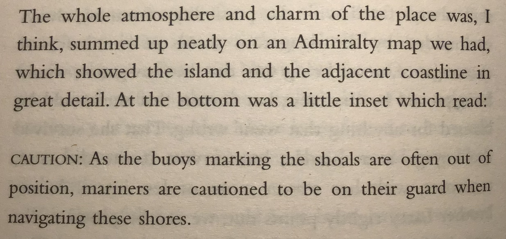

# Nursery

Nursery is a collection of notes related to the "nurseries" part of the "talent scouting & nurseries" label I have chosen to denote what I do professionally.

John le Carré calls, in his books, the MI6 training centre "the nursery".

The Nursery contains a [Column](https://github.com/dahoum/Nursery/tree/master/Column), where I reflect my current thoughts, [Practices](Practices/README.md), [People](People/FEADME.md) and ventures.

I use Nurseries as a source of reminders and inspiration to:

* develop talent
* help the establishment and growth of Practices
* help structuring startups and scale ups as well as restructuring organisations

## Inspiration

The collection is based on my experience.

It would have been impossible w/o all those, whom I have worked w/.

If I may use one quote, to underline this effort, it will be this:

> “When you grow up you tend to get told that the world is the way it is and your life is just to live your life inside the world. Try not to bash into the walls too much. Try to have a nice family life, have fun, save a little money. That's a very limited life. Life can be much broader once you discover one simple fact: Everything around you that you call life was made up by people that were no smarter than you. And you can change it, you can influence it… Once you learn that, you'll never be the same again.”

## Caution

My Family And Other Animals, Gerald Durrell

## Have a Question or need Help?

I help gladly.

Check my [LinkedIn](https://www.linkedin.com/in/dahoum/) and if you still want to talk to me, drop me a line at t.e.shaw@dahoum.wales.
