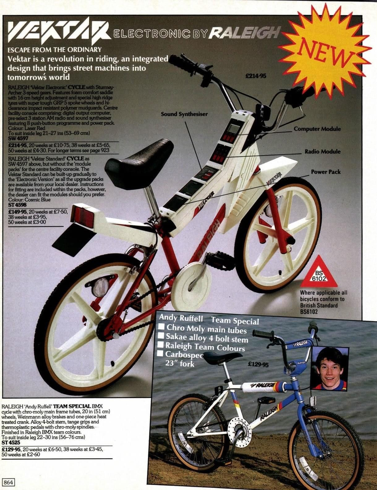

# Time

## Ahead of its Time

### 24/7 Self-Service Shop (1965]

https://vm.tiktok.com/ZMdQ3Cb6B/

### Raleigh

https://en.wikipedia.org/wiki/Raleigh_Bicycle_Company

The Notthingham based Raleigh is the oldest bicycle company in the world.

#### Raleigh Vektar

__*__ 1985

## Timeline

### Richard Branson in Space

Richard Branson flew into space 17 years after founding Virgin Galactic in 2004, 52 years after the Moon landing and 60 years after Gagarin became the first human in space: if your project does not materialise w/in few days, weeks, months or even years—do not fret.

_posted on LinkedIn_

### L'Arc de Triomphe, Wrapped

[59 years passed](https://christojeanneclaude.net/artworks/arc-de-triomphe-wrapped/) between the original idea and the implementation in 2021, both Christo and Jeanne-Claude died before that.

### Mad Men

[7 years passed](https://youtu.be/Ln3dvXzjetM) between writing the pilot and the 2nd episode.
